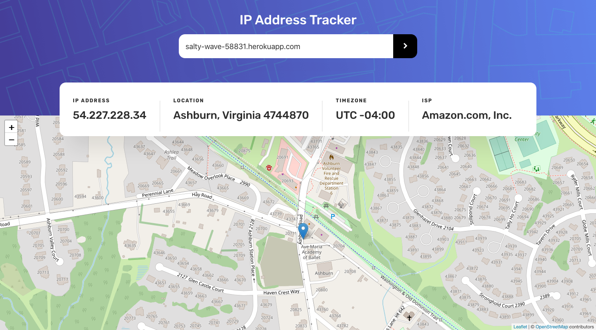
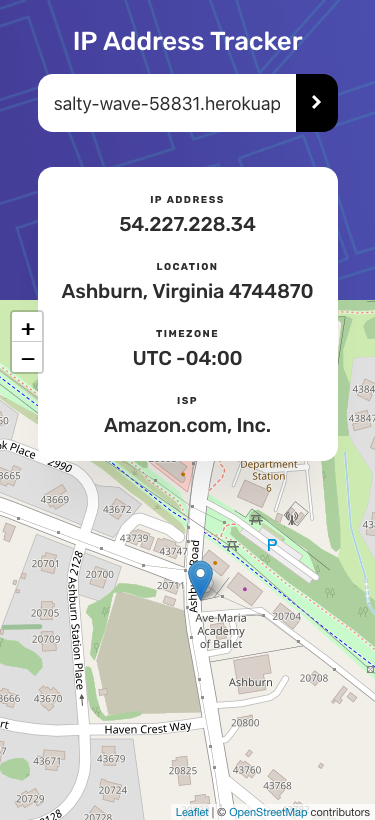

# Frontend Mentor - IP address tracker solution

This is a solution to the [IP address tracker challenge on Frontend Mentor](https://www.frontendmentor.io/challenges/ip-address-tracker-I8-0yYAH0).

Live Site URL: [Ip Address Tracker](https://salty-wave-58831.herokuapp.com/)

## Table of contents

- [Overview](#overview)
  - [The challenge](#the-challenge)
  - [Screenshot](#screenshot)
  - [Links](#links)
- [My process](#my-process)
  - [Built with](#built-with)
  - [Useful resources](#useful-resources)
- [Author](#author)

## Overview

### The challenge

Users should be able to:

- View the optimal layout for each page depending on their device's screen size
- See hover states for all interactive elements on the page
- See their own IP address on the map on the initial page load
- Search for any IP addresses or domains and see the key information and location

### Screenshot

#### Desktop

#### Mobile

### Links

- Solution URL: [Github Repository](https://github.com/MiguelSteph/ip-tracker-react)
- Live Site URL: [Ip Address Tracker](https://salty-wave-58831.herokuapp.com/)

## My process

### Built with

- Semantic HTML5 markup
- CSS custom properties
- Flexbox
- CSS Grid
- Mobile-first workflow
- [React](https://reactjs.org/) - JS library
- [Leaflet JS](https://leafletjs.com/) - JS library

### Useful resources

- [Leaflet Tutorial](https://leafletjs.com/examples.html) - This helped me to learn how to add leaflet to the project.

## Author

- Linkedin - [Miguel KAKANAKOU](https://www.linkedin.com/in/kakanakou-miguel/)
